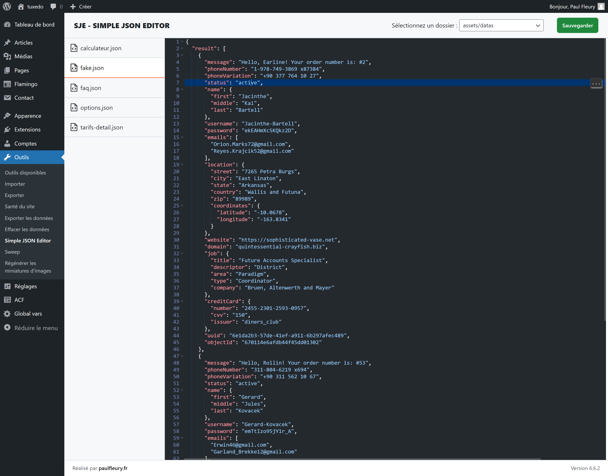

# SJE - Simple JSON Editor


SJE (Simple JSON Editor) est un éditeur JSON élégant et facile à utiliser pour vos fichiers de thème WordPress.

## Description

SJE simplifie l'édition des fichiers JSON dans vos thèmes WordPress. Que vous soyez un développeur expérimenté ou un débutant, SJE vous offre une interface intuitive pour manipuler vos données JSON directement depuis le tableau de bord WordPress.

### Caractéristiques principales

- Interface utilisateur intuitive et élégante
- Coloration syntaxique pour une meilleure lisibilité
- Validation en temps réel des fichiers JSON
- Sauvegarde sécurisée des modifications
- Compatible avec tous les thèmes WordPress

SJE est l'outil parfait pour les développeurs de thèmes et les administrateurs de sites qui ont besoin de modifier régulièrement des fichiers de configuration JSON.

## Installation

### Via WordPress

1. Recherchez "SJE - Simple JSON Editor" dans le menu 'Ajouter un nouveau plugin' de WordPress.
2. Cliquez sur "Installer maintenant", puis sur "Activer".

### Installation manuelle

1. Téléchargez le fichier zip du plugin et décompressez-le.
2. Uploadez le dossier `sje` dans le répertoire `/wp-content/plugins/` de votre site WordPress.
3. Activez le plugin via le menu 'Plugins' dans WordPress.

## Utilisation

Après l'activation, accédez à l'éditeur via le menu 'Outils > SJE' dans votre tableau de bord WordPress.

## FAQ

**Q: Puis-je utiliser SJE pour éditer d'autres types de fichiers ?**

R: Non, SJE est spécifiquement conçu pour l'édition de fichiers JSON. Pour d'autres types de fichiers, veuillez utiliser l'éditeur de fichiers intégré à WordPress ou un plugin dédié.

**Q: Est-ce que SJE sauvegarde automatiquement mes modifications ?**

R: Non, SJE ne sauvegarde pas automatiquement. Vous devez cliquer sur le bouton "Sauvegarder" pour enregistrer vos modifications. Cela vous permet de vérifier vos changements avant de les appliquer.

## Captures d'écran

Interface de SJE


## Changelog

### 1.0.0
- Première version publique
- Interface utilisateur intuitive pour l'édition de fichiers JSON
- Coloration syntaxique et validation en temps réel
- Sauvegarde sécurisée des modifications

## Contribuer

Les contributions sont les bienvenues ! N'hésitez pas à ouvrir une issue ou à soumettre une pull request.

## Licence

Ce projet est sous licence GPL v2 ou ultérieure. Voir le fichier [LICENSE](LICENSE) pour plus de détails.

## Auteur

Créé par [Paul Fleury](https://paulfleury.fr)

## Exemple d'utilisation

Voici un exemple rapide de structure JSON que vous pouvez éditer avec SJE :

```json
{
  "name": "Mon Super Thème",
  "version": "1.0.0",
  "author": "Paul Fleury",
  "settings": {
    "color": {
      "palette": [
        {
          "name": "Primary",
          "slug": "primary",
          "color": "#0073aa"
        },
        {
          "name": "Secondary",
          "slug": "secondary",
          "color": "#23282d"
        }
      ]
    }
  }
}
```

Utilisez SJE pour éditer facilement ce type de structure directement depuis votre tableau de bord WordPress !