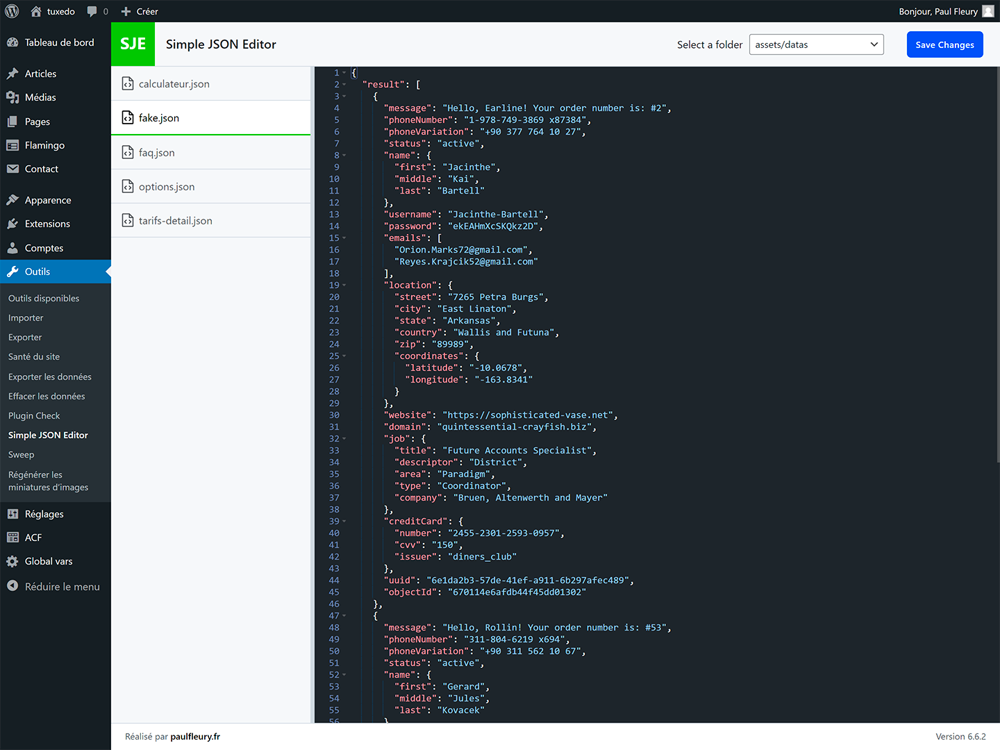

# SJE - Simple JSON Editor


SJE (Simple JSON Editor) is an elegant and easy-to-use JSON editor for your WordPress theme files.

## Description

SJE simplifies the editing of JSON files in your WordPress themes. Whether you're an experienced developer or a beginner, SJE offers you an intuitive interface to manipulate your JSON data directly from the WordPress dashboard.

### Key Features

- Intuitive and elegant user interface
- Syntax highlighting for better readability
- Real-time JSON file validation
- Secure saving of modifications
- Compatible with all WordPress themes
- Smart folder display: only folders containing JSON files are shown in the selection menu
- Easy navigation through your theme's JSON files

SJE is the perfect tool for theme developers and site administrators who need to regularly modify JSON configuration files. By displaying only relevant folders, SJE streamlines your workflow and helps you focus on the JSON files that matter.

## Credits

SJE uses the following open-source software:

- [ACE Editor](https://ace.c9.io/) - A high performance code editor for the web
- [Split.js](https://split.js.org/) - A lightweight, high-performance splitting library

## Installation

### Via WordPress

1. Search for "SJE - Simple JSON Editor" in the 'Add New Plugin' menu in WordPress.
2. Click "Install Now" and then "Activate".

### Manual Installation

1. Download the plugin zip file and extract it.
2. Upload the `sje` folder to the `/wp-content/plugins/` directory of your WordPress site.
3. Activate the plugin through the 'Plugins' menu in WordPress.

## Usage

After activation, access the editor via the 'Tools > SJE' menu in your WordPress dashboard.

## FAQ

**Q: Can I use SJE to edit other types of files?**

A: No, SJE is specifically designed for editing JSON files. For other file types, please use the built-in WordPress file editor or a dedicated plugin.

**Q: Does SJE automatically save my changes?**

A: No, SJE does not auto-save. You must click the "Save Changes" button to save your modifications. This allows you to review your changes before applying them.

**Q: Why do I only see some folders in the selection menu?**

A: SJE intelligently displays only folders that contain JSON files. This helps streamline your workflow by focusing on relevant directories.


## Screenshots

SJE Interface


## Changelog

### 1.1.0
- Added column resizing functionality using Split Grid
- Improved user interface flexibility
- Updated ACE Editor integration for better performance with resizable layout

### 1.0.0
- Initial public release
- Intuitive user interface for JSON file editing
- Syntax highlighting and real-time validation
- Secure saving of modifications

## Contributing

Contributions are welcome! Feel free to open an issue or submit a pull request.

## License

This project is licensed under the GPL v3 or later. See the [LICENSE](https://www.gnu.org/licenses/gpl-3.0.html) file for details.

## Author

Created by [Paul Fleury](https://paulfleury.fr)

## Usage Example

Here's a quick example of a JSON structure you can edit with SJE:

```json
{
  "name": "My Awesome Theme",
  "version": "1.0.0",
  "author": "Paul Fleury",
  "settings": {
    "color": {
      "palette": [
        {
          "name": "Primary",
          "slug": "primary",
          "color": "#0073aa"
        },
        {
          "name": "Secondary",
          "slug": "secondary",
          "color": "#23282d"
        }
      ]
    }
  }
}
```

Use SJE to easily edit this type of structure directly from your WordPress dashboard!